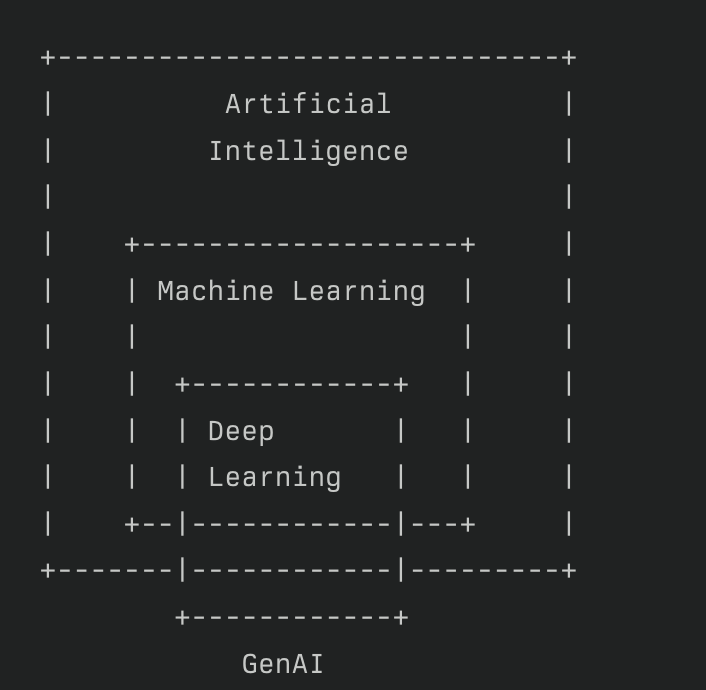

# RoadMap To Learn

*  Python Programming Language

*  Stastics for Data Science - 
    https://www.youtube.com/watch?v=zRUliXuwJCQ&list=PLZoTAELRMXVMhVyr3Ri9IQ-t5QPBtxzJO

* Machine Learning Models -
    https://www.youtube.com/watch?v=z8sxaUw_f-M&list=PLZoTAELRMXVPjaAzURB77Kz0YXxj65tYz

* Deep Learning Community Session - 
    https://www.youtube.com/watch?v=8arGWdq_KL0&list=PLZoTAELRMXVPiyueAqA_eQnsycC_DSBns 

*  Basic NLP 
    https://www.youtube.com/watch?v=8arGWdq_KL0&list=PLZoTAELRMXVPiyueAqA_eQnsycC_DSBns

*  Basic Deep Learning
    https://www.youtube.com/watch?v=8arGWdq_KL0&list=PLZoTAELRMXVPiyueAqA_eQnsycC_DSBns

*  Advances NLP Concepts 
    https://www.youtube.com/watch?v=ZwYtqTaZ2io&list=PLZoTAELRMXVNNrHSKv36Lr3_156yCo6Nn&index=9

*  Gen AI Topics

# AI 

* Build Application that can perform its own task with human intervention.
* Ex : Movie Recommendation , Self Driving Car 

# ML

* Subset of AI
* stat tools to perform the complete life cycle of a project using data. 

# Deep Learning 

* Subset of Machine Learning .
* This is mimicing human brain. 
* Multi Layered Nural Network. 
    * ANN
    * CNN and Object Detection - Computer Vision
    * RNN & its variant - Text Related Use cases and Time series Use cases .
        * Transformer 
        * BERT 

* Type of Deep Learning Models :
    * Discriminative Models 
        * Classification
        * Prediction 
        * Trained on Labeled Dataset
    * Generative Models
        * LLM ( Large Language Model) - Text 
        * LIM ( Large Image Model ) - Image
        * Generates new data as it is trained on huge amount of data 
        * Based on any input it generates new data itself.

# Genearative AI
* Subset of Deep Learning !!

* LLM Models : - Foundation and Pre Trained Models which are trained on Huge amount of data available on the Internet.
* Example :
    * OpenAI - GPT4 
    * Meta - LAMA2
    * Google - Gemini , Gemma
    * Antopic - Cloude3 

* They can also be used for domain specific use cases and for that Fine Tuning is required with own custom dataset.

* Lang Chain  - is a framework which will be used to work with these models. 

* We can generate REG Application / RAG Application 