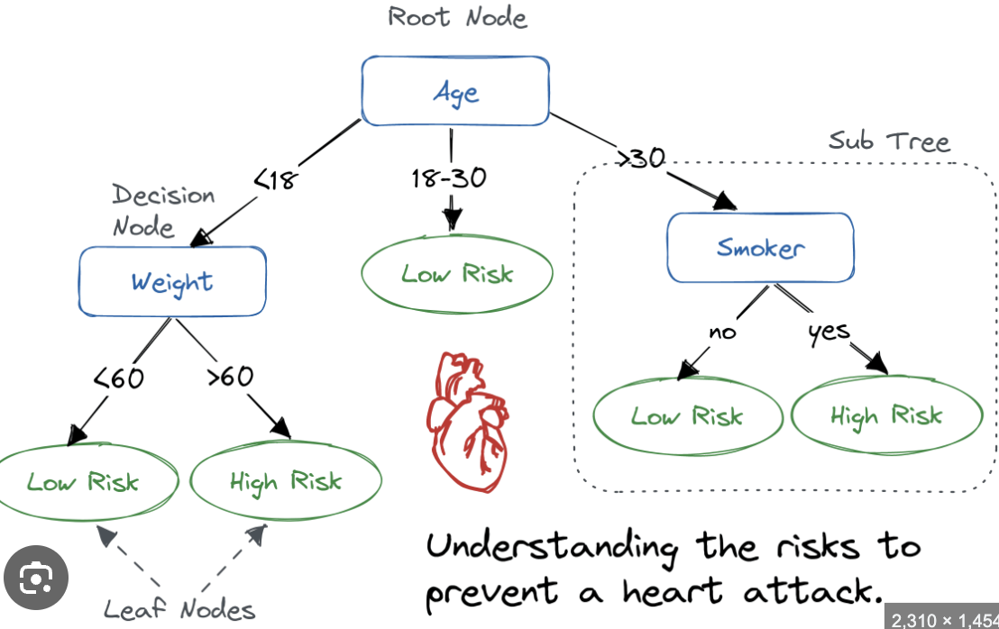
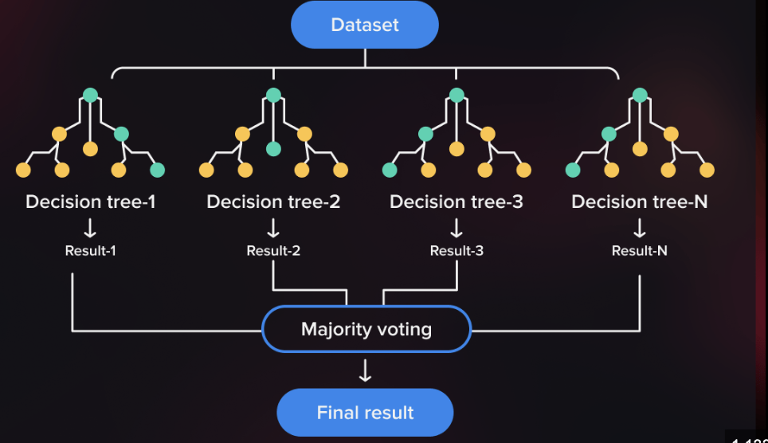
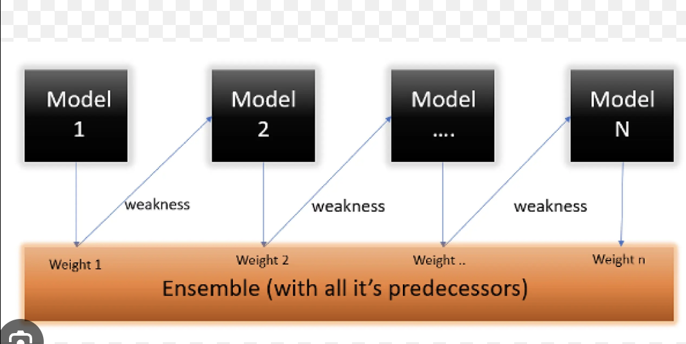
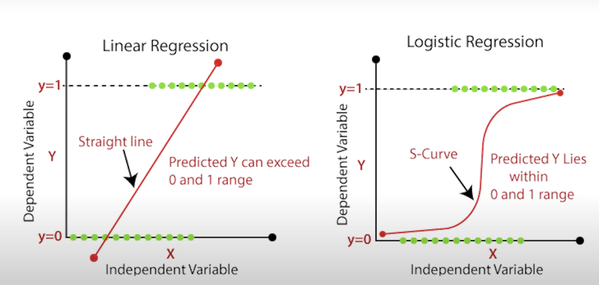
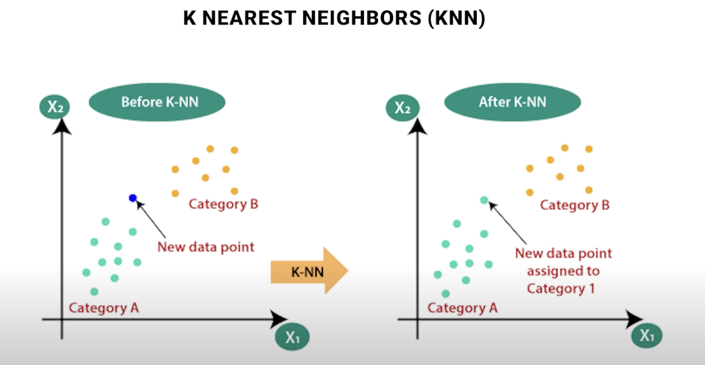
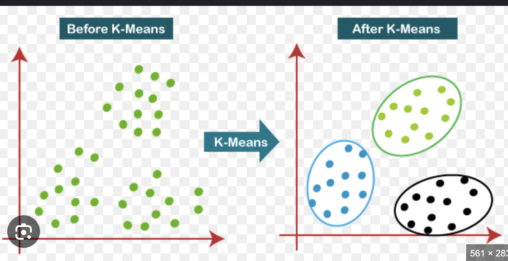
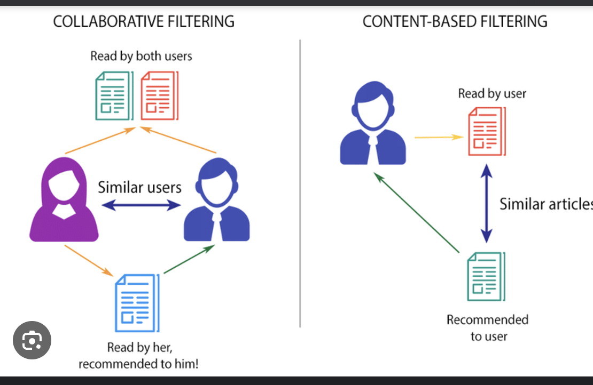

* Supervised Learning - Height, Weight, Labelled Data
    * Regression
        1) Linear Regression 
            The data point can be ploted in one line . 
            y = mx + c
            Ex - Height and shoe size 
        2) Decision Tree
            
        3) Random Forest - Parallel Learning
            
        4) Ada Boost (Adaptive Boosting)
            
        5) Gradient Boost -  XGBoost
        

    * Classification - Email Label - Spam, social   
        1) Logistic  Regression
            
        2) Support Vector Machine (SVM)
            A Support Vector Machine (SVM) is a method for classifying linear and nonlinear data by finding the optimal separating hyperplane using support vectors and margins.
        3) K Nearest Neighbors (KNN)
            The K-nearest neighbors (KNN) algorithm is a supervised machine learning algorithm that uses a data set to predict the classification or regression of a new data point
            

* Unsupervised Learning
    * K Means - Segmentation and Bucketing
        The k-means clustering algorithm operates by categorizing data points into clusters by using a mathematical distance measure, usually euclidean, from the cluster center. The objective is to minimize the sum of distances between data points and their assigned clusters.
        

    * Collaborative Filtering
        Collaborative filtering is a recommender system that uses user interactions and data to suggest items to users based on the preferences of other users with similar interests
        
    

    

