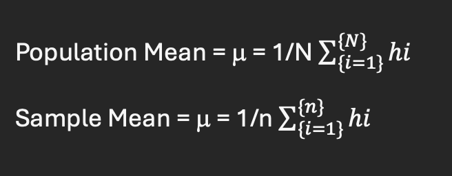
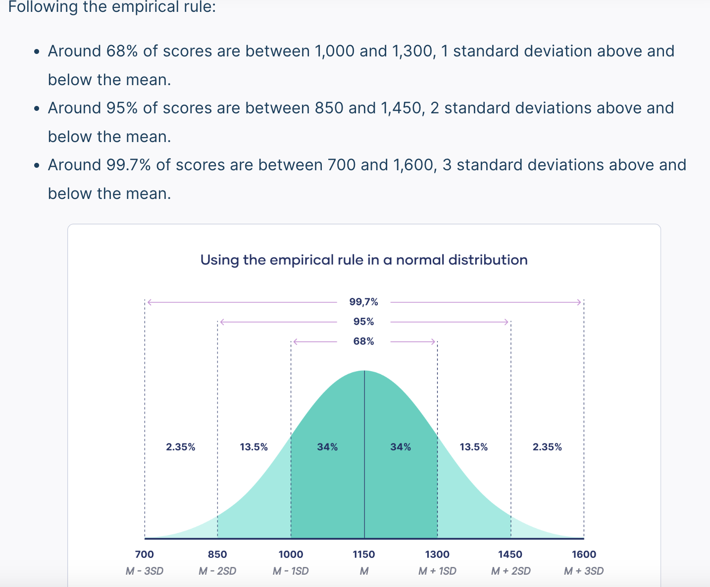
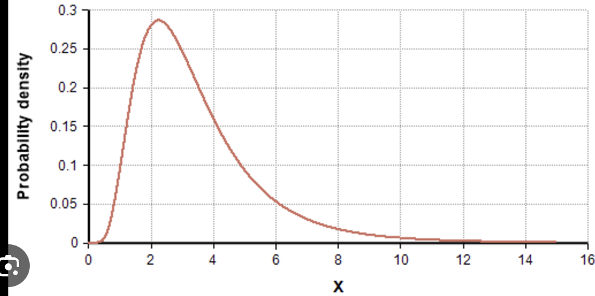
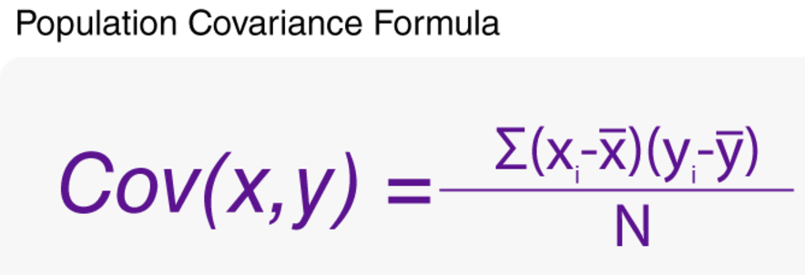
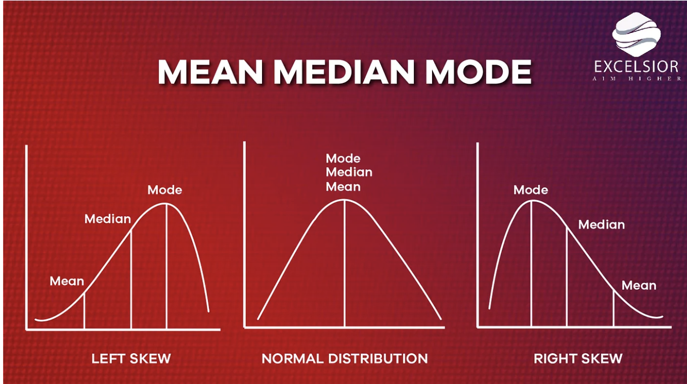
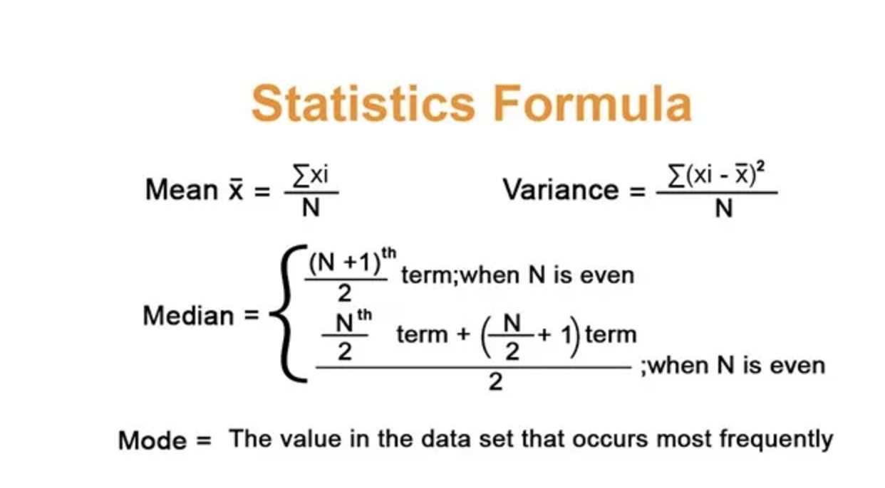
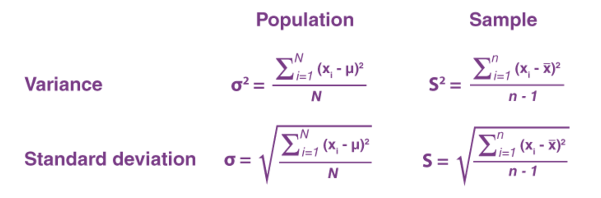

1) Statistics is the science of collecting, organizing, analysing, interpreting, and presenting the data
2) Two Categories of Statistics - Descriptive Statistics and Inferential Statistics
3) Descriptive Statistics  - Organizing and summarizing data using numbers and graphs.
     - Measures of Central Tendency
     - Measures of Variability
4) Inferential Statistics - To make an inference e.g. Confidence Interval and Margin of Error
5) Difference b/w Descriptive and Inferential Statistics:
     * a) Descriptive - Done on Entire Population or Sample
     * b) Inferential - Done on sample drawn from a population e.g. Z-test, T-test, Chi squared test, Hypothesis Testing, Confidence Interval, etc.

# Population & Sample :

* Population is a collection of all items of interest (N).
* Sample is a subset of a population (n) .
* Parameter – It is a value that refers to a population
* Statistics – It is a value that refers to a sample.

Population Mean > Sample Mean and with increasing sample , it will reach the population mean

# Random Variables 

1) Numerical RV 
    * Discrete Random Variables  - whole number but not floating number 
        * Ex - Number of bank account , Population of state
    * Continouse Random Variables - within the range we can have any value
        * Ex - height - 155.3 cm, ROI , Salary

2) Categorical RV
    * A categorical random variable is a discrete variable with more than two possible outcomes. 
        * Ex - race, sex, age group, and educational level

# Gaussian Distribution / Normal Distribution

* Normal distribution, also known as the Gaussian distribution, is a probability distribution that is symmetric about the mean, showing that data near the mean are more frequent in occurrence than data far from the mean.

x ~ N ( mu and sigma )

* Ex - Height Distribution

# Log Normal Distribution 

* If the log of any random variable is a normal distribution then it becomes A lognormal distribution.

    x = {x1 , x2 , x3 , x4 ....}
    if log(x1), log(x2), log(x3).. plots a normal distribution curve.

*  This is right skewed. 
*  Ex : Income of the people , Product review comments lenght

With the same scale of data (standard normal distribution ) , the model accuracy is more when algorithm is applied.

# Co-variance (COV)

* Covariance indicates the relationship of two variables whenever one variable changes. If an increase in one variable results in an increase in the other variable, both variables are said to have a positive covariance.

x increases then y increses - +ve co-variance
x increases then y decreases - -ve co-variance

# Mean , Median & Mode

* Mean: The average of a set of numbers, calculated by adding all the numbers and dividing by the total number of values.

* Median: The middle value in a set of numbers that are ordered from least to greatest.

* Mode: The number that appears most often in a set of numbers.

# Measure of Dispersion
* Range: The difference between the maximum and minimum values in a set of data. It's a simple measure of dispersion, but it's not very reliable because it's based on two extreme values. 
* Standard deviation: The average deviation from the mean of a set of data. It's the most commonly used measure of dispersion. 
* Variance: The average of the squared deviations from the mean of a set of data. 
* Interquartile range (IQR): The range of the middle half of a set of data, which is divided into four equal sections called quartiles. This is a useful measure when a set of data contains outliers. 
* Coefficient of variation (C.V.): 100 times the standard deviation divided by the mean. 

